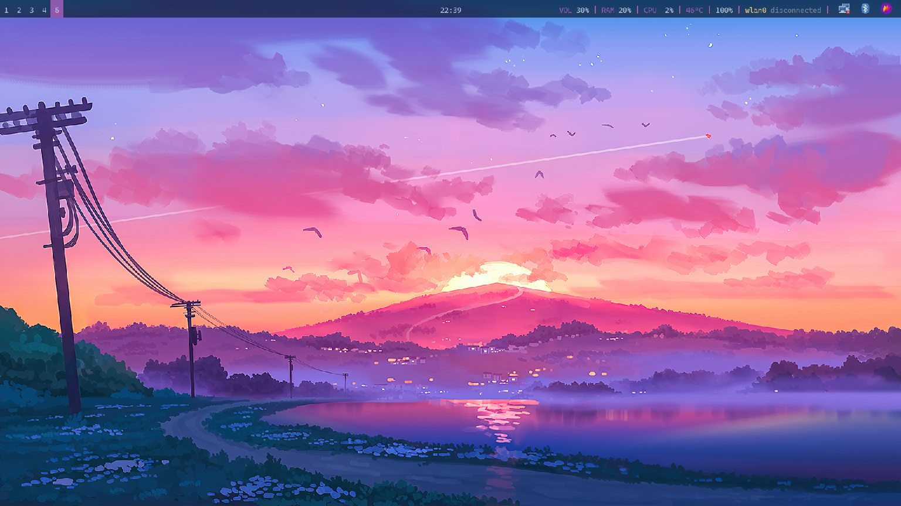
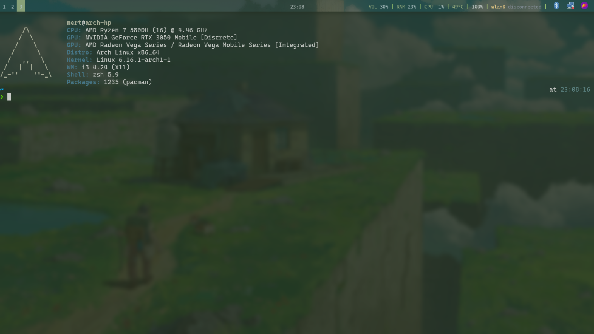
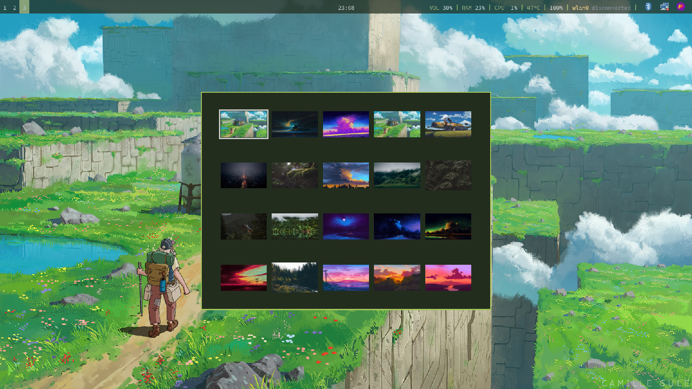

# Dot-Files
These are the config files for i3 and other programs I use for my desktop.

## Screenshots

## Resources
The wallpapermenu script is from Bread on Penguins Youtube channel. You can check [this](https://github.com/BreadOnPenguins/scripts) for his other scripts. Also you can check his [Youtube Channel](https://www.youtube.com/@BreadOnPenguins). She has lots of good videos about Linux etc.     

The wallpapers in the screenshots are from [this repo](https://github.com/dharmx/walls/tree/main)
